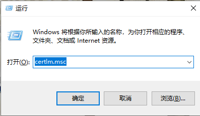
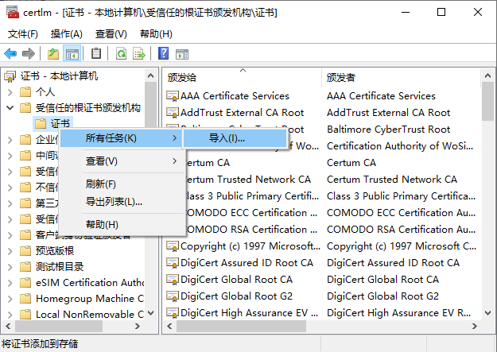
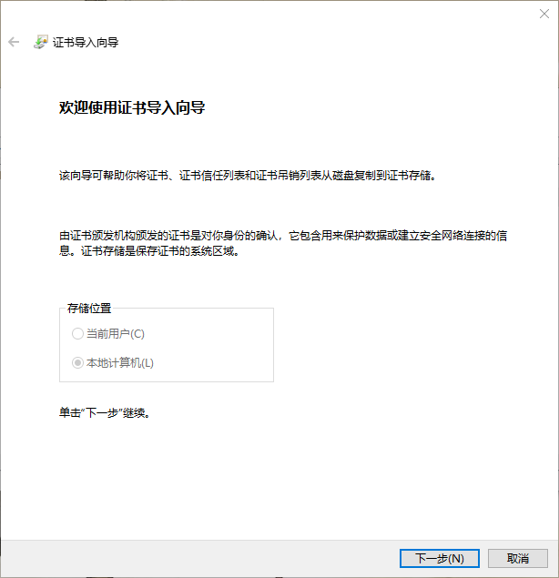
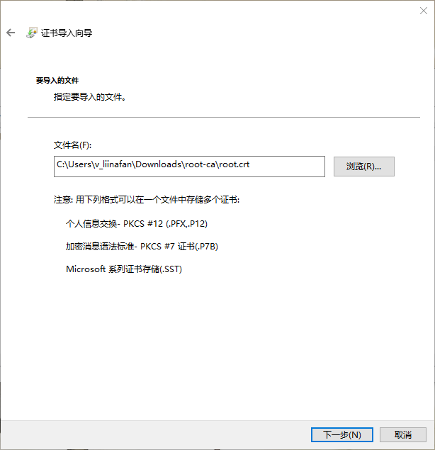
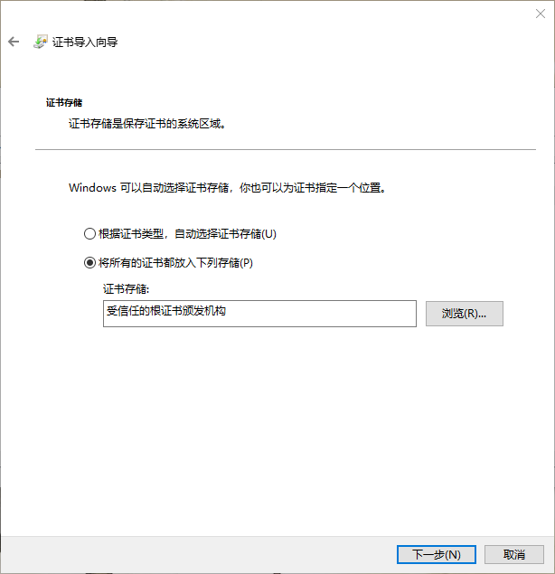
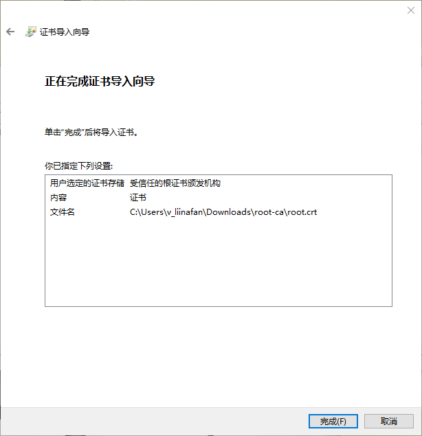
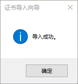

**ssh证书**

mac 操作步骤: https://jingyan.baidu.com/article/5225f26ba6dbfce6fb090856.html ；

windows 操作步骤:  https://mos86.com/40020.html ；

其中windows操作步骤中，通过操作当前用户的证书管理单元后证书未生效时，可通过以下的方法解决：

1.Windows键+R并放置certlm.msc在运行对话框。单击确定打开证书管理器管理单元。

2.在证书管理器窗口中，单击受信任的根证书颁发机构右键单击证书并选择所有任务

3.在证书导入向导中，单击下一步。

4.浏览证书根文件（请确保选择正确的文件格式.crt /.cer，.p7b /.spc等）,然后点击下一步

5.在下一个屏幕上，选择“将所有的证书都放入下列存储”，证书存储下浏览选择“受信任的根证书颁发机构”。点击下一步。

6.单击完成。

几秒后，会提示导入成功。

此时完成了操作。