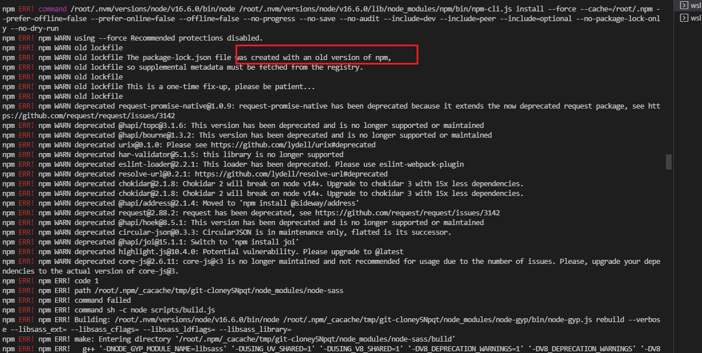

# Issue

1.将已有node_modules结构删除，执行npm cache clean --force，重新npm i;

2.按照提示输入npm install --force / npm install --save --legacy-peer-deps

3.**node版本**（降级或升级）

a.[一般powershell](https://stackoverflow.com/questions/64573177/unable-to-resolve-dependency-tree-error-when-installing-npm-packages)



b.Ubuntu-20.04

查看eslint检查文件错误的地方：./node_modules/.bin/eslint --fix ./src   ===>报错：segment default

解决：ubuntu下，考虑node版本的问题，如果直接npm install -g n，n install更新了node之后不生效，[可考虑将node，npm的安装信息全部清理，再重新安装](https://www.jianshu.com/p/53a1e12bb790)。

不过当时安装的时候未成功，用的是另外的方式：nvm管理node

```
apt-get remove nodejs

curl -sL https://raw.githubusercontent.com/creationix/nvm/v0.33.8/install.sh -o install_nvm.sh

nvm install v14.15.0
```

4.**环境配置**：当配置的环境路径与安装路径不一样，会导致安装包失败；
之前npm安装包的路径设置在了/c/users/xxx/appdata/roaming/目录下，而node的安装路径却是/c/program files/nodejs/node_global/node_modules，导致安装某个包如taro时，安装到了c/users/xxx/appdata/roaming目录下，就算安装成功了（非全局可安装）也会导致taro命令读取失败(node的目录和npm的最大父级目录不一致)

