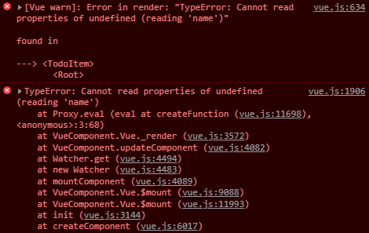

# Basic

可通过directives局部注册/全局注册自定义指令.

**v-slot**

1. 默认内容

父组件

```
<script>
import Test from './Test.vue'
  
export default {
  components: { Test }
}
</script>

<template>
 	<Test>
      <h1>
        aaa
      </h1>
  </Test>
</template>
```

子组件 Test.vue

```
<template>
  <div class="container">
    <slot />
  </div>
</template>
<script>
  export default {
  	data() {
      return {
      }
    }
	}
</script>

<style>
  .container {
    width: 100px;
    height: 100px;
    border: 1px solid red;
  }
</style>
```

2. 具名插槽

父组件

```
<script>
import BaseLayout from './BaseLayout.vue'
  
export default {
  components: {
    BaseLayout
  },
  methods: {
     clickHeader() {
        // 修改header默认内容
        this.$refs.headerTitle.innerText = 'Ok!'
    }
  }
}
</script>

<template>
  <BaseLayout>
    <template #header="headerProps">
      <h1 ref="headerTitle" @click="clickHeader">{{headerProps.txt}}</h1>
    </template>

    <template #default>
      <p>A paragraph for the main content.</p>
      <p>And another one.</p>
    </template>

    <template #footer>
      <p>Here's some contact info</p>
    </template>
  </BaseLayout>
</template>
```
子组件 BaseLayout.vue
```
<template>
  <div class="container">
    <header>
      <slot name="header" :txt="message"></slot>
    </header>
    <default>
      <slot name="default"></slot>
    </default>
    <footer>
      <slot name="footer"></slot>
    </footer>
  </div>
</template>

<script>
  export default {
    data() {
      return {
        message: 'aaaaa'
      }
    }
  }
</script>
<style>
  footer {
    border-top: 1px solid #ccc;
    color: #666;
    font-size: 0.8em;
  }
</style>
```
# Issue

**VUE 自定义子组件v-bind及v-on指令的大小写问题**

参考链接：[VUE 自定义子组件v-bind及v-on指令的大小写问题](https://blog.csdn.net/yunhuaikong/article/details/95206060)



